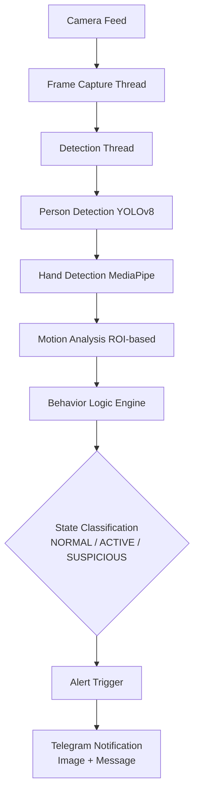
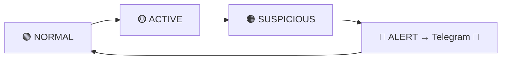

# 🚨 Real-Time AI Shoplifting Detection System

[](https://www.python.org/)
[](LICENSE)
[](https://opencv.org/)
[](https://ultralytics.com/)
[](https://www.tensorflow.org/)
[](https://mediapipe.dev/)

<div align="center">
  
**Advanced real-time shoplifting detection using YOLOv8 person tracking + MediaPipe hand detection + rule-based AI analysis.**

</div>

## 📋 Table of Contents
- [🎯 Overview](#-overview)
- [⚙️ Technologies Used](#️-technologies-used)
- [🏗️ System Architecture](#️-system-architecture)
- [📋 Project Structure](#-project-structure)
- [🚀 Quick Start](#-quick-start)
- [🔧 Configuration](#-configuration)
- [🎮 Detection Logic](#️-detection-logic)
- [🚨 Alert System](#-alert-system)
- [🔁 Features](#-features)
- [📊 Performance](#-performance)
- [📦 Requirements](#-requirements)
- [🛠️ Extending](#️-extending)
- [🚀 Future Enhancements](#-future-enhancements)
- [🔍 Troubleshooting](#-troubleshooting)
- [📱 Demo Preview](#-demo-preview)
- [🏁 Conclusion](#-conclusion)
- [📄 License](#-license)

---

## 🎯 Overview
This project is an **AI-powered real-time surveillance system** designed to detect potential shoplifting behavior using computer vision techniques. It processes live video from a camera, tracks human movement, analyzes hand activity near the **pocket/waist region**, and generates alerts when suspicious patterns are detected.

An Advanced **real-time shoplifting detection** using YOLOv8 person tracking + MediaPipe hand detection + rule-based AI analysis. 

**Key Capabilities:**
- Precise waist/pocket zone motion detection (ignores irrelevant areas)
- 4-state escalation: NORMAL → ACTIVE → SUSPICIOUS → ALERT
- Instant Telegram alerts with timestamped snapshots
- Professional surveillance UI (FPS, motion trails, color-coded states)
- Multi-threaded for 30+ FPS performance

---

## ⚙️ Technologies Used

| Component          | Technology          |
|--------------------|---------------------|
| Person Detection   | YOLOv8 (Ultralytics)|
| Hand Tracking      | MediaPipe Hands     |
| Motion Analysis    | OpenCV (Frame Differencing) |
| Programming Language | Python            |
| Alert System       | Telegram Bot API    |
| Multithreading     | Python threading    |

---

## 🏗️ System Architecture



---

## 📋 Project Structure
```
g:/DAVINCI/animation 1/Shop/
├── main.py           # Core application & visualization
├── config.py         # Configuration & camera settings
├── detector.py       # Model inference & shoplifting logic
├── tracker.py        # YOLOv8 person detection/tracking
├── alert.py          # Telegram, console, email alerts
├── utils.py          # Computer vision utilities
├── requirements.txt  # Dependencies (updated: torch, numpy 1.26+)
├── TODO.md           # Task progress tracker
├── README.md         # 📖 This file
├── model.h5          # Custom shoplifting model (optional)
├── yolov8n.pt        # YOLO person detector
├── .gitignore
└── LICENSE
```

---

## 🚀 Quick Start
```bash
# 1. Activate virtual environment (recommended)
python -m venv venv
# Windows: venv\\Scripts\\activate
# Linux/Mac: source venv/bin/activate

# 2. Install dependencies
pip install -r requirements.txt

# 3. Configure Telegram (optional)
# Copy secrets to .env or edit config.py:
# TELEGRAM_BOT_TOKEN=your_bot_token
# TELEGRAM_CHAT_ID=your_chat_id

# 4. Run
python main.py
```
*Press 'q' to quit. Camera opens automatically (ID=0).* 

---

## 🔧 Configuration
Edit `config.py`:
```python
CAMERA_ID = 0                    # Webcam or video path
FRAME_WIDTH, FRAME_HEIGHT = 640, 480
ALERT_THRESHOLD = 0.9
TELEGRAM_BOT_TOKEN = ""          # From BotFather
TELEGRAM_CHAT_ID = ""            # Your chat ID
```

Or use `.env` file:
```
TELEGRAM_BOT_TOKEN=...
TELEGRAM_CHAT_ID=...
```

---

## 🎮 Detection Logic
1. **YOLOv8**: Detect persons
2. **MediaPipe Hands**: Track hand motion trails
3. **ROI Analysis**: Focus upper 40% (torso/hands), ignore legs
4. **Motion Scoring**: EMA-smoothed frame-diff in pocket zone
5. **State Machine**: Hysteresis prevents false positives
6. **Alert**: 5+ suspicious frames → Telegram snapshot

**Visual States:**
- 🟢 **NORMAL** (idle)
- 🟡 **ACTIVE** (motion detected)
- 🟠 **SUSPICIOUS** (pocket activity)
- 🔴 **ALERT** (confirmed threat)

---

## 🚨 Alert System

- Sends **real-time alerts via Telegram**
- Includes:
  - Snapshot image  
  - Alert message  
- Uses fallback mechanism:
  - Photo → Text (if photo fails)

---

## 🔁 Features

- Real-time multi-person tracking  
- Threaded architecture for performance  
- ROI-based motion detection  
- Per-hand tracking (no overlap issues)  
- Motion streak-based classification  
- Clean and professional UI  

---

## 📊 Performance
- **FPS**: 30+ on modern CPU
- **Threads**: Capture + Detection + Display
- **Memory**: Optimized ROI crops (64x72)

---

## 📦 Requirements

```
opencv-python>=4.8.0
numpy>=1.26.0
pillow>=9.0.0
tensorflow==2.16.1     # Note: Python ≤3.12 preferred
mediapipe==0.10.14
ultralytics>=8.2.0
torch>=2.0.0
requests==2.32.3
```

**TF Note**: On Python 3.14, use conda or `pip install tensorflow-cpu==2.16.1` if model.h5 needed (falls back to rules otherwise).

---

## 🛠️ Extending
- **New Alerts**: Subclass `AlertSystem` in alert.py
- **Custom Model**: Replace `model.h5`, update detector.py
- **Thresholds**: Tune in main.py stability params

---

<details>
<summary>🚀 Future Enhancements (click to expand)</summary>

## 🧠 1. Deep Learning-Based Behavior Model
- Replace rule-based logic with **LSTM / Transformer models**
- Learn real shoplifting patterns from data  

## 🧍‍♂️ 2. Pose Estimation Integration
- Use **MediaPipe Pose / OpenPose**
- Better understanding of:
  - body posture  
  - hand-object interaction  

## 🧾 3. Object Interaction Detection
- Detect if item is picked and hidden  
- Combine with object detection (YOLO classes)

## 🧠 4. Re-Identification (ReID)
- Track same person across multiple cameras  
- Useful for large stores  

## 📊 5. Dashboard & Analytics
- Store logs in database  
- Create web dashboard:
  - heatmaps  
  - suspicious activity trends  

## ☁️ 6. Cloud Integration
- Deploy system on cloud (AWS / GCP)  
- Remote monitoring  

## 🔔 7. Multi-Channel Alerts
- Email + SMS + Mobile App notifications  
- Real-time push alerts  

## 🎥 8. Multi-Camera Support
- Handle multiple CCTV feeds simultaneously  
- Centralized monitoring system  

## ⚡ 9. Edge Optimization
- Convert models to **TensorRT / ONNX**
- Run efficiently on edge devices (Jetson Nano)

## 🧪 10. Dataset Creation & Training
- Build custom dataset of shoplifting scenarios  
- Train specialized detection models  

</details>

---

## 🔍 Troubleshooting

| Issue              | Solution                                      |
|--------------------|-----------------------------------------------|
| No camera          | Set `CAMERA_ID=1` or video.mp4 path           |
| ImportError        | `pip install -r requirements.txt`             |
| No Telegram        | Check bot token/chat ID in config.py          |
| Low FPS            | Reduce `FRAME_WIDTH=480`                      |
| model.h5 missing   | Falls back to pure rule-based detection       |

---

## 📱 Demo Preview
<div align="center">



*Professional surveillance UI with motion trails, states, FPS overlay*

</div>

---

## 🏁 Conclusion

This project demonstrates how **computer vision + behavior analysis** can be used to build a practical surveillance system for detecting suspicious activities in real time.

It serves as a strong foundation for developing **intelligent retail security solutions**.

---

## 📄 License
[](LICENSE)

**Author**: AI Shoplifting Detection System - Vipin Gupta

<div align="center">
  <sub>⭐ Star the repo if this helps you!</sub>
</div>

